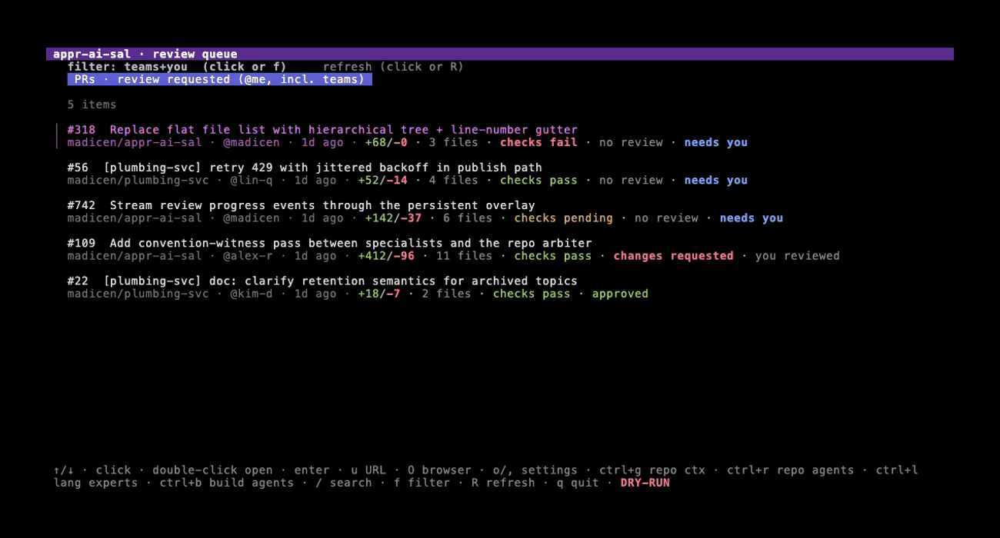
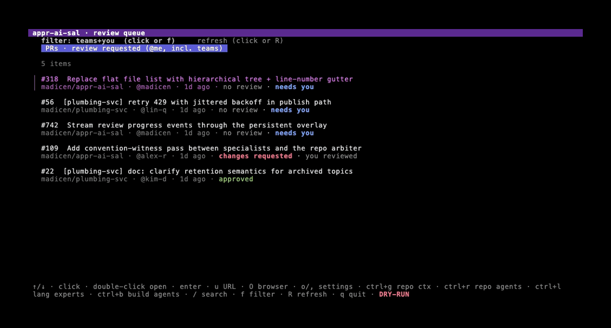
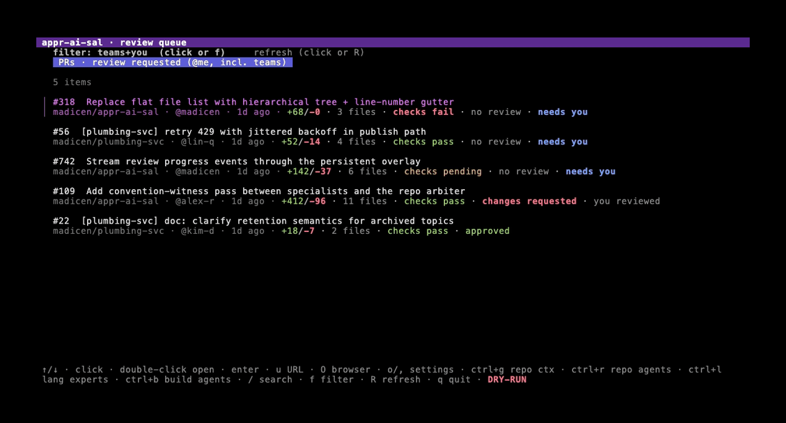
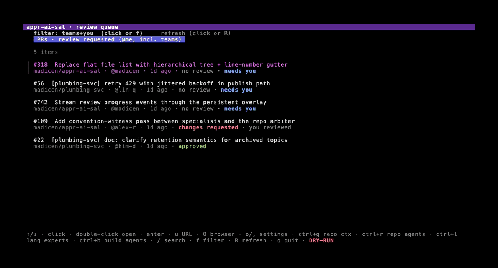
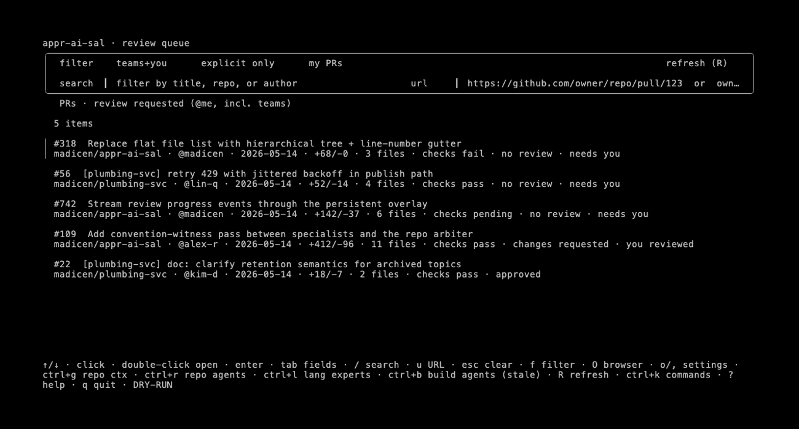

# appr-ai-sal

A terminal app that pulls the GitHub PRs you've been asked to review, runs a
panel of specialist AI reviewers over them, and lets you edit and post the
review with a keypress. You stay in the loop — nothing goes to GitHub without
your confirmation.

## Quick start

New here? This walks you from zero to your first AI-assisted review.
Skim the [Demo](#demo) below first if you want to see what the TUI looks
like before installing.

### 1. Install the prerequisites

- **Go 1.22+** — check with `go version`.
- **GitHub CLI** — install [`gh`](https://cli.github.com/) (**version 2.0.0 or newer**) and run `gh auth login` once. `appr-ai-sal` reuses `gh`'s stored auth for all GitHub access — GraphQL/REST calls now run in-process (no separate token to configure), and a couple of convenience reads still shell out to `gh`. Startup fails with a clear message if `gh` is missing, too old, or not logged in.
- **Pick one AI backend:**
  - **Claude (default, simplest)** — install the [Claude Code CLI](https://docs.anthropic.com/en/docs/claude-code) so `claude` is on your `PATH`. No extra config needed.
  - **Ollama (local, no API key)** — install [Ollama](https://ollama.com) and pull a model, e.g. `ollama pull llama3.2`.
  - **Gemini** — grab an API key from [Google AI Studio](https://aistudio.google.com/apikey).
  - **OpenAI-compatible** — note your server's base URL (e.g. `https://api.example.com/v1`) and API key.

### 2. Install appr-ai-sal

**Homebrew (macOS / Linux, recommended):**

```bash
brew install madicen/tap/appr-ai-sal
```

This also pulls in `gh` if you don't already have it. Verify with `appr-ai-sal -h`.

**From source (any platform with a Go toolchain):**

```bash
go install github.com/madicen/appr-ai-sal/cmd/appr-ai-sal@latest
```

This drops the binary in `$GOBIN` (typically `~/go/bin`). Make sure that
directory is on your `PATH`, then verify with `appr-ai-sal -h`.

### 3. Point it at your AI backend

If you installed the `claude` CLI you can skip this step — Claude is the
default. Otherwise export the variables for your chosen provider:

```bash
# Ollama (local, no key needed)
export APPR_AI_SAL_AI_PROVIDER=ollama
export APPR_AI_SAL_AI_MODEL=llama3.2

# Gemini
export APPR_AI_SAL_AI_PROVIDER=gemini
export APPR_AI_SAL_AI_MODEL=gemini-2.0-flash
export APPR_AI_SAL_AI_API_KEY=...

# OpenAI-compatible
export APPR_AI_SAL_AI_PROVIDER=openai_compatible
export APPR_AI_SAL_AI_BASE_URL=https://api.example.com/v1
export APPR_AI_SAL_AI_MODEL=...
export APPR_AI_SAL_AI_API_KEY=...
```

Prefer a GUI? Launch the app and press `o` to open **Settings** with the AI
fields focused — `ctrl+s` saves to `~/.config/appr-ai-sal/ai.json` so you
don't have to keep these env vars around.

### 4. Run your first review

```bash
appr-ai-sal
```

In the TUI:

1. The left pane lists PRs where you've been requested as a reviewer. Use `↑`/`↓` (or `j`/`k`) to highlight one and press `enter` to open it.
   - Empty list? Press `u` to paste a PR URL (e.g. `https://github.com/owner/repo/pull/123`) or `owner/repo#123` shorthand.
2. Press `r` to run the specialist panel. You'll see per-specialist progress while they run in parallel.
3. Read through the rendered draft. Press `,` if you want to dial the review's intensity up or down (lenient / balanced / strict).
4. Press `p` to post the draft as a GitHub review — you'll get a confirm prompt first. Press `q` or `esc` to walk away without posting; **nothing is sent until you confirm**.

Want to kick the tires without touching GitHub or your AI provider? Try the
self-contained demo mode, which runs end-to-end against canned data:

```bash
appr-ai-sal --demo
```

For full details on configuration, providers, repository context, and every
keybinding, keep reading.

## Demo

The hero recording walks through opening a PR, firing the specialist
panel, watching the synthetic pipeline progress through every stage, and
landing on the rendered summary:



<details>
<summary>PR detail navigation (overview selector for Description / Checks / Discussion, file tree, pane focus)</summary>



A small selector above the file tree lets you swap the centre pane between
the rendered PR description, the status-check rollup (with failing-run
output and annotation excerpts inline), and the Conversation timeline
(issue comments + review-summary bodies, time-sorted). Press `g` to jump
to the description, `j`/`k` to walk the unified left-column cursor across
the overview rows and into the file tree, or click any row.

Drag the vertical seam between any two panes to resize them — the border
columns where the panes meet are a 2-cell-wide hit zone. Min widths
keep each pane (and the diff) usable; the resized layout resets to the
defaults on the next app restart.

</details>

<details>
<summary>Repo agents tab — fresh / missing mix, regen flow</summary>



</details>

<details>
<summary>Language agents tab — scoped to the diff's stack</summary>



</details>

<details>
<summary>Settings — AI provider, strictness chips, repo-context tab</summary>



</details>

The recordings come from a self-contained `--demo` mode that swaps the
`gh` CLI, AI providers, and on-disk cache for canned data, so they're
reproducible offline. To regenerate:

```sh
brew install vhs   # one-time, https://github.com/charmbracelet/vhs
make screenshots   # runs every tape under vhs/ and writes screenshots/*.gif
make gif-review-run  # regen just one tape during iteration
make demo          # boot the demo binary interactively (no gh / no AI calls)
```

The tape scripts live in [`vhs/`](vhs/) and the canned data in
[`internal/demo/`](internal/demo/). Tape timings (sleeps, typing speed)
are tuned for a 1300×700 capture; tweak the `Set` directives at the top
of each tape if you need a different size.

The same specialist prompts and JSON contracts are used for every backend;
only the inference transport changes (subprocess `claude` vs HTTP). A bounded
**repository context** block (convention files from the PR worktree plus
optional merged-PR digest) is injected into every specialist and the vibe coach
so Claude and HTTP backends see the same baseline “repo culture” text. The
[Review pipeline](#review-pipeline) section below walks through every agent
that participates in a run.

### Review strictness

How hard specialists (and the vibe coach) should push—**lenient** (rubber stamp:
only egregious issues), **balanced** (default), or **strict** (thorough pass).
The vibe coach is told that each JSON `prompt` must be copy-pasteable text for
the author’s AI to **fix the concrete problems** in the specialist findings,
not generic advice.

Set via `review_strictness` in `ai.json`, **`APPR_AI_SAL_REVIEW_STRICTNESS`**, the
in-app **Settings** pane (**`,`** opens with review strictness focused; **`o`** opens with AI fields focused), or **`-review-strictness`**. Accepted aliases include
`light` / `rubber_stamp` → lenient and `thorough` / `heavy` → strict.

## Requirements

- Go 1.22+
- `gh` (GitHub CLI) — used for auth; run `gh auth login` once
- One AI backend (pick one):
  - **Claude** — `claude` (Claude Code CLI) on your `PATH` (default)
  - **Gemini** — Google AI API key; model id such as `gemini-2.0-flash`
  - **Ollama** — local OpenAI-compatible server (default base `http://127.0.0.1:11434/v1`)
  - **OpenAI-compatible** — any server implementing `POST …/v1/chat/completions` (set base URL)

Auth for GitHub is delegated to `gh`. HTTP backends use your configured API key
where required; keys are not printed in progress logs. The TUI masks the API
key field.

## Install

```bash
brew install madicen/tap/appr-ai-sal     # macOS / Linux, brings in gh
# or
make install                             # installs to $GOBIN (typically ~/go/bin)
# or
go install github.com/madicen/appr-ai-sal/cmd/appr-ai-sal@latest
```

## Usage

```bash
appr-ai-sal
```

Opens a two-pane TUI:

- **Left**: PRs where you've been requested as a reviewer.
- **Right**: PR detail, diff, and the draft review.

### Keybinds

Every binding lives in one central keymap (`internal/tui/keys`), so the bottom
status bar, the `?` help overlay, and the `ctrl+k` command palette all describe
the *same* keys — a hint can't drift from the action it triggers. Two global
shortcuts are always available from the queue and detail screens (they yield to
the search / URL fields while you're typing into them):

| Key       | Action                                                  |
|-----------|---------------------------------------------------------|
| `?`       | Toggle the full **keyboard-shortcut help** overlay (all bindings by context; `?` / `esc` closes) |
| `ctrl+k`  | Open the **command palette** — fuzzy-search every action available right now, `↑` / `↓` to move, `enter` to run, `esc` to close |
| `ctrl+c`  | Quit from anywhere                                       |

**Review queue (list):**

| Key       | Action                                                  |
|-----------|---------------------------------------------------------|
| `↑` / `↓` | Move in the PR list                                     |
| `enter`   | Open the highlighted PR                                 |
| `/`       | Focus the inline search field (title / repo / author / `#123`) |
| `u`       | Focus the URL field — paste a PR URL or `owner/repo#N` shorthand |
| `f`       | Cycle the review-queue filter                           |
| `tab` / `shift+tab` | Cycle focus between the list and the search / URL fields |
| `R`       | Refresh the PR list                                     |
| `A`       | **Queue a review over every listed PR** — runs the pipeline on each one sequentially (respecting the inference concurrency cap); progress shows in the list title, press `A` again to cancel |
| `y`       | Copy the highlighted PR's URL to the clipboard          |
| `O`       | Open the highlighted PR in the browser                  |
| `q`       | Quit                                                    |

**PR detail:**

| Key       | Action                                                  |
|-----------|---------------------------------------------------------|
| `j` / `k` | Move the file-tree cursor (or `↓` / `↑`)               |
| `tab` / `shift+tab` | Cycle the tree / diff / controls panes        |
| `space` / `enter` | Fold the current folder row                     |
| `r`       | Run the specialist panel on the open PR                 |
| `c`       | Show / hide the Review controls pane                    |
| `a`       | Reopen the approval overlay                             |
| `g`       | Toggle description / diff                               |
| `d`       | Toggle full-width diff                                  |
| `P`       | Bulk-post the draft (with a confirm step)               |
| `ctrl+d` / `ctrl+u` | Half-page down / up in the diff               |
| `n` / `p` | With the diff focused: **jump to the next / previous inline finding tag** (or, while a diff search is active, the next / previous match) |
| `/`       | **Search the diff** — type a query, `enter` jumps to the first match, then `n` / `p` step between hits; `esc` cancels |
| `t`       | **Toggle existing PR review comments** inline in the diff (rendered at their anchor lines) |
| `H`       | Open the **review-history pane** — browse the PR's inline review threads (`j`/`k` to move, `r` to reply, `esc` back) |
| `y`       | Copy the PR's URL to the clipboard                      |
| `O`       | Open the PR in the browser                              |
| `esc` / `q` | Back to the list                                      |

The diff pane is **syntax-highlighted** (via chroma, by file extension; it
degrades to plain text on an unknown language or when `NO_COLOR` is set) and
shows **word-level intra-line diffs** — when a line is edited in place, only the
changed spans are emphasised rather than the whole line.

**Review overlay (approval flow):**

While walking a finding's approval card you can edit its comment before it's
posted, and copy the finding or its hunk out to your clipboard:

| Key       | Action                                                  |
|-----------|---------------------------------------------------------|
| `e`       | **Edit the comment inline** — opens a textarea pre-filled with the finding's body; `ctrl+s` saves (the posted comment uses your edited text), `esc` cancels, `ctrl+e` hands the buffer to `$EDITOR` |
| `E`       | **Edit the comment in `$EDITOR`** — opens `$VISUAL`/`$EDITOR` on a temp file and reads it back on exit; falls back to the inline editor when neither is set |
| `ctrl+y`  | Copy the current finding (location + comment) to the clipboard |
| `ctrl+o`  | Copy the current finding's diff hunk to the clipboard   |
| `S`       | **Sort the finding cards** — cycle severity desc → confidence desc → specialist → file |
| `f`       | **Filter by severity floor** — cycle none → warning+ → critical-only (findings below the floor are hidden, never dropped from the draft) |
| `J`       | **Jump to the diff** — minimise the overlay and scroll the PR diff to the focused finding's hunk/line |

Sort and filter are a **view over the card list** — the underlying draft is never
mutated, and the focused card is kept visible when a filter would otherwise hide
it. The review tab bar shows **per-severity counts** (e.g. `2 critical · 5
warning`) so you can see the shape of a review at a glance.

Edited comments are persisted with the [draft session](#draft-persistence--resume-pick-up-a-mid-approval-review),
so a resumed review keeps your wording. Clipboard copies use the native system
clipboard (pbcopy / xclip / wl-copy) and automatically fall back to an **OSC 52**
terminal escape when no native clipboard is reachable — so copies work over SSH
too. A copy that fails every path just flashes a brief status; it never
interrupts the flow.

When a review run (or a queued batch) finishes, appr-ai-sal rings the terminal
bell and emits an **OSC 9** desktop-notification escape naming the PR, so you get
pinged if you backgrounded the terminal during a long run. Closing the review
overlay cancels the in-flight run so nothing keeps churning behind a dismissed
overlay.

**Shared navigation (queue + detail):**

| Key       | Action                                                  |
|-----------|---------------------------------------------------------|
| `o`       | Open **Settings** with AI fields focused (provider, model, URL, key, timeout); **ctrl+s** saves to `ai.json` |
| `,`       | Open **Settings** with review strictness focused (**ctrl+,** is often sent as **ctrl+@** and works the same) |
| `ctrl+g`  | Open **Settings** on the repo-context tab               |
| `ctrl+r`  | Open the **Repo agents** tab                            |
| `ctrl+l`  | Open the **Language experts** tab                       |
| `ctrl+b`  | Build / refresh repo agents for the current PR / repo   |
| `ctrl+t`  | Tech experts for the current PR (detail only)           |

Not sure what's available? Press `?` for the full list, or `ctrl+k` to
fuzzy-search commands — the palette shows exactly the actions enabled on the
current screen and runs each one via the same code path as its key.

### Theming & appearance

All chrome is driven by a single **semantic colour palette** in
`internal/theme`: named roles (`bg`, `fg`, `surface`, `accent`, plus `muted`,
`border`, `selection`, the `info`/`success`/`warning`/`error`/`critical` status
colours, and the diff add/remove tints). Every style in the TUI resolves its
colours from these roles, so there are no stray hardcoded hexes to drift.

**Presets.** Two presets ship — `dark` (the default) and `light` — as pure data
tables, so adding another appearance is a data change, not a code change. The
per-row **tag** and **severity** colours remain individually customisable in the
**Theme** settings subtab (persisted to `theme.json`).

**Selecting an appearance.** Precedence, highest first:

1. **`NO_COLOR`** (any value, see <https://no-color.org/>) → fully monochrome:
   no ANSI colour for chrome **or** syntax highlighting.
2. **`APPR_AI_SAL_THEME`** = `dark` | `light` | `auto` | `none`
   (`auto` follows your terminal's background; `none` = monochrome).
3. The persisted `"mode"` in `theme.json`.
4. The built-in default: **dark** (so the app looks the same as it always has).

```bash
APPR_AI_SAL_THEME=light appr-ai-sal   # force the light preset
APPR_AI_SAL_THEME=auto  appr-ai-sal   # adapt to the terminal background
NO_COLOR=1              appr-ai-sal    # monochrome (pipes, screen readers, etc.)
```

`theme.json` (under `~/.config/appr-ai-sal/`, honouring `APPR_AI_SAL_CONFIG_DIR`
/ `$XDG_CONFIG_HOME`) can pin the preset alongside any colour overrides:

```json
{ "mode": "light", "colors": { "tag_security": "#ff5f87" } }
```

### Specialists

Each comment in the draft is tagged with the specialist that produced it.
Posted GitHub bodies state clearly that **appr-ai-sal** (AI) generated the text
and name the **agent** (specialist). GitHub **suggestion** blocks are only used
when the model supplies literal replacement code; otherwise feedback stays
comment-only. PR-wide notes use `path` / `line` cleared so they appear in the
review summary instead of on a line.

Specialist labels in the UI:

- `[formatting]` — style, naming, layout, lint-style nits
- `[design]` — separation of concerns, abstractions, API shape
- `[testing]` — coverage gaps, missing edge cases, brittle tests
- `[docs]` — missing or stale comments and docstrings
- `[security]` — secrets, injection, unsafe defaults
- `[vibe-coach]` — prompts the author can paste back into their AI to fix
  the most important issues in one pass

Specialist prompts ship embedded in the binary (sourced from
`internal/review/prompts/<name>.md` in this repo). To customize a specialist
without rebuilding from source, drop an override at
`~/.config/appr-ai-sal/prompts/<name>.md` (or `$XDG_CONFIG_HOME/appr-ai-sal/prompts/<name>.md`).
The override takes precedence over the embedded prompt.

### User-defined specialists

The built-in panel is described by a declarative **registry** (each specialist
is a `SpecialistSpec`: its kind, inputs, deterministic gates, lane priority,
arbiter policy, witnessability, and severity ladder). You can add your own
review lane — for example a `performance` or `i18n` specialist — without
rebuilding the binary by dropping a **`.json` + `.md` pair** into:

```
~/.config/appr-ai-sal/specialists/<name>.json   # the spec
~/.config/appr-ai-sal/specialists/<name>.md      # the system prompt
```

(honours `$XDG_CONFIG_HOME` / `APPR_AI_SAL_CONFIG_DIR` like every other config
path). The `.json` is the serializable subset of a spec:

```json
{
  "name": "performance",
  "kind": "code",                       // "code" (diff, line-by-line) or "pr-wide"
  "prompt_file": "performance.md",       // optional; defaults to <name>.md
  "inputs": ["diff"],                    // diff | evidence-pack | checks | threads | discussion
  "gates": [],                            // e.g. "actionability" (demote bare "lacks X" findings)
  "lane_priority": 40,                    // lower wins a same-line dedupe; built-ins use 0–9
  "arbiter_policy": { "suppressible": true, "demotable": true },
  "witnessable": false,                   // feed findings to the convention witness
  "pr_scope": "",                         // pr-wide agents only: "whole-pr" | "thread-anchored"
  "severity_ladder": "info: …; warning: …; error: …"
}
```

A code specialist you add runs on every review alongside the built-ins and its
findings flow through the same deterministic gates, cross-specialist dedupe,
and repo arbiter as any built-in. The `severity_ladder` is appended to your
prompt so the model calibrates against it.

Loading is **fail-open**: a malformed or incomplete spec (bad JSON, missing
prompt, name colliding with a built-in) is logged to the
[log file](#logging) and skipped — it never crashes a review run. A built-in
specialist's name can never be shadowed by a user file.

A ready-to-copy example ships in the repo at
[`docs/examples/specialists/performance.{json,md}`](docs/examples/specialists/) —
copy the pair into `~/.config/appr-ai-sal/specialists/` to try it.

## Review pipeline

A run is a chain of small agents, each with a narrow job. The
[Specialists](#specialists) subsection above lists the five code reviewers
whose tags you see on each finding; this section explains every agent that
participates — including the briefs they consume — and the order things
happen in.

### The agents

- **Code-reviewing specialists** (5 agents: `formatting`, `design`,
  `testing`, `docs`, `security`). Each reads the PR (diff + injected
  context briefs, repository tools when running on Claude) and returns
  structured findings inside its lane. They never reach outside their
  specialty in the rendered output, and every comment in the draft is
  tagged with the specialist that produced it. Parallel by default;
  toggle **Parallel specialists** off in the Review controls pane (or set
  `parallel_specialists: false` in `repo-context.json`) to run them
  sequentially. A client-side cap (`max_concurrent_inference`, default 3)
  bounds how many inference calls run at once across the whole run, so
  parallel dispatch never bursts past provider rate limits.

- **Repo agents** (one brief per `(repo, specialist)`). Short markdown
  documents describing how *this* repo handles each topic — e.g. the
  testing brief might say "small pure helpers ship without tests in this
  codebase." Each specialist's brief is threaded into its own user
  prompt before it runs, so the specialist's findings reflect the local
  convention rather than a generic best-practice. Open the **Repo
  agents** tab with `ctrl+r` (or click the row in the controls pane);
  build / refresh from the PR you're on with `ctrl+b`.

- **Tech experts** (one brief per `(repo, technology)`). Per-stack
  conventions — e.g. "Kestra flows in this repo register triggers via
  X." A tech brief lives on a repo and is shared across all five
  specialists for that repo. Tech experts are opt-in: a fresh repo has
  none until you add one. Manage them with `ctrl+t`.

- **Language briefs** (one brief per language). Convention notes that
  apply *across* repos — Python uses `snake_case`, Go's exported
  identifiers carry godoc comments, etc. The runner picks the brief(s)
  matching the diff's dominant language(s) and injects them into every
  specialist. The top-5 languages ship as bundled defaults; you can
  generate, edit, and refresh them in the **Lang agents** tab (`ctrl+l`).

- **Repository context block**. A bounded text blob built from the PR
  worktree's convention files (`AGENTS.md`, `README`, lint configs)
  plus an optional digest of recent merged-PR titles. Surfaced to the
  human reviewer in the TUI; the per-specialist repo agent briefs above
  are what specialists actually consume on the prompt side.

- **Per-PR evidence pack**. Static + history evidence harvested from
  the PR worktree (sibling test files, doc.go presence,
  exported-symbol coverage, recent merged PRs touching the changed
  paths). Currently injected only into the `testing` and `docs`
  specialists and reused by the convention witness below.

- **Intent pre-pass** (`intent`). A single cheap LLM call at the very
  start of the run that reads the PR **description** plus any **linked
  issues** and extracts a structured object —
  `{intent, acceptance_criteria, non_goals, linked_issues}` — via a
  schema-backed JSON call (native JSON mode applies just like the other
  stages). Linked issues are discovered two ways and unioned: GitHub's
  own `closingIssuesReferences` connection **and** closing keywords
  parsed from the body (`closes #12`, `fixes owner/repo#34`, a full
  issue URL); each issue's title + body is fetched behind the gh cache.
  The extracted intent is injected as a `## PR author intent` section
  into the three stages that otherwise guess intent from the title —
  **scope** (judges scope creep against the stated intent, not the
  title), **testing** (turns acceptance criteria into expected test
  cases), and the **vibe coach** (grounds its verdict and "done-when"
  prompts). It routes as its own `intent` stage, so
  [per-stage model routing](#per-stage-model-routing--ensembles) can
  send it to a small/cheap model. The whole pre-pass is **fully
  fail-open**: no description and no issues, an inaccessible/private
  issue, a fetch error, or a model/parse failure all mean the section
  is simply empty and those three stages behave exactly as they did
  before — byte-for-byte.

- **Static-analysis pre-pass**. Before any LLM call, cheap
  deterministic tools run over the changed files in the worktree:
  `gofmt -l` and `go vet` (they ship with the Go toolchain),
  plus `golangci-lint`, `ruff`, and `eslint` **when the repo
  configures them** (detected from the worktree's lint configs), and
  `terraform validate` for Terraform changes. Each runs behind its own
  timeout and is **fully fail-open** — a missing binary, absent config,
  slow tool, or broken invocation contributes nothing and never errors
  or blocks the review. The results are injected three ways: (1) every
  code specialist is told *"the linter already flags X — don't
  re-report it; report what linters can't see"*; (2) the `checks` agent
  receives the tool annotations alongside the CI rollup; (3) a file a
  formatter passed **clean** becomes a false-positive signal that
  downgrades hand-rolled whitespace/indentation findings there. The IaC
  schema gate additionally consults live `terraform providers schema
  -json` when terraform is present, falling back to a built-in table of
  non-taggable AWS resources otherwise.

- **Context expansion for backends without repo tools** (`context-expand`).
  Only the `claude` subprocess provider gets live repo tools
  (`Read,Glob,Grep`, scoped to the PR worktree); every HTTP provider
  (`ollama` / `openai_compatible`, `gemini`) reviews the **diff blind** —
  it sees only the changed hunks, not the enclosing function bodies, the
  types the changed code references, or who calls the changed functions.
  When the active provider's capabilities report `RepoTools == false`,
  appr-ai-sal deterministically gathers that surrounding code and injects
  it into every code specialist as a **read-only** `## Expanded code
  context` section (placed just before the diff, clearly framed as *not*
  part of the change). For the Claude subprocess (`RepoTools == true`) it
  is a **no-op** — that backend reads the worktree itself, so the prompts
  are byte-for-byte unchanged.
  - **What it gathers**, in relevance order: (1) the **full enclosing
    function body** for each changed hunk (a hunk usually shows only part
    of a function); (2) the **type definitions** the changed code
    references (same package); (3) **callers / callees** of the changed
    functions.
  - **Source ladder** (most authoritative first, all fail-open): a
    hermetic **Go `go/parser` + `go/ast`** pass over the worktree files is
    the always-available baseline for (1), (2) and same-package (3) — no
    external binary, fully deterministic. **`gopls`** (references) and
    **ctags** (definitions) are *optional enrichers*, run behind an
    on-PATH check and a per-call timeout, that add cross-file
    callers/callees the AST baseline can't cheaply see; they are never
    required.
  - **Budget**: the whole block is capped under a per-provider byte budget
    derived from the same R3 diff-budget table (an eighth of it, clamped),
    filled greedily by relevance with a per-item cap; truncation/omission
    is disclosed inline. The expansion can never blow the context window.
  - **Language coverage**: the AST path is **Go-only**. Non-Go changed
    files are skipped (the ctags enricher can still resolve cross-file
    references when present); an unparseable file, a missing tool, a
    timeout, or a non-Go repo all contribute nothing and never break the
    review.

- **Convention witness**. A per-finding sanity check that fires
  *between* the specialists and the arbiter for `testing` / `docs`
  findings. For each finding it answers a single question — "does the
  rest of this repo actually do what this finding asks for?" — and
  tags it `congruent`, `divergent`, or `unknown` with a short
  citation. The arbiter consumes the verdicts; reviewers see the
  divergent/congruent/unknown tallies in the rendered review body.
  Disabled by setting `convention_witness: false` in
  `repo-context.json`.

- **Repo arbiter**. The last gate before the human sees the findings.
  Reads every specialist's output plus the briefs and convention
  witnesses, and may **suppress** an inline comment (drop it from the
  GitHub post; still shown in the TUI so the reviewer can override),
  **demote** its severity by one rank, or **override** the merge
  verdict. Defaults to "trust the specialists" — most calibration
  already happened upstream via the briefs — and only intervenes when
  a finding contradicts an explicit repo norm. Disabled by setting
  `repo_expert_panel: false` in `repo-context.json`.

- **Vibe coach**. A synthesis pass after the arbiter that reads the
  surviving findings and emits (a) a merge **verdict** (`approve` /
  `request_changes` / `comment`) and (b) a small set of paste-ready
  **author prompts** the PR author can drop into *their* AI assistant
  to fix the most important issues in one or two iterations. Re-runs
  lazily if you skip findings during the approval flow so the verdict
  and summary stay in sync with what you're actually posting.

### Run order

1. **Worktree + diff** — check the PR head out into
   `~/.cache/appr-ai-sal/worktrees/`, fetch the unified diff. No LLM
   calls yet. The checkout is backed by a shared bare-repo cache: one bare
   mirror per `owner/repo` is kept under `~/.cache/appr-ai-sal/repos/`, so a
   repeat review fetches only the delta and adds a per-run `git worktree`
   instead of a full clone (and reuses the existing worktree when the head
   SHA hasn't changed). If anything in the cache path fails it falls back to
   a fresh full clone, so a run never dies because of the cache.
2. **Context injection** — load the per-specialist repo agent briefs,
   tech expert briefs, language briefs, the repository context block,
   and (for `testing` / `docs`) the per-PR evidence pack. Progress for
   each appears in the **Context injection** group at the top of the
   running overlay.
   The **static-analysis pre-pass** also runs here (still no LLM
   calls): `gofmt`/`go vet` and any configured linters run over the
   changed files behind timeouts, fail-open, grounding the specialists
   and the `checks` agent in real tool output.
   For HTTP providers (no repo tools) the **context-expand** pass also
   runs here — still no LLM calls — deterministically gathering the
   enclosing functions, referenced types, and callers/callees the change
   touches so those backends don't review blind. It is a no-op for the
   `claude` subprocess (which reads the worktree live).
   The **intent pre-pass** (one cheap LLM call, routed as the `intent`
   stage) also runs here, concurrently with context composition: it
   fetches the linked issues and extracts the author's intent /
   acceptance criteria / non-goals for the `scope`, `testing`, and
   vibe-coach stages. Fail-open — an empty result leaves those stages
   unchanged.
3. **Specialists** run with their injected briefs (parallel by
   default; set `parallel_specialists: false` to serialize). Concurrency
   across the whole run is capped by `max_concurrent_inference` (default
   3). Each one is independently retried inside its own per-stage budget.
   On a **re-review** of a PR that received new commits, the specialists
   run only over the files that changed since the last review and prior
   findings on unchanged files are carried forward — see
   [Incremental re-review](#incremental-re-review-odelta-on-new-commits).
4. **Convention witness** (optional) classifies every testing/docs
   finding against the PR evidence pack.
5. **Reviewer memory** (see [Reviewer memory](#reviewer-memory-learns-from-acceptskip))
   runs its deterministic pre-arbiter suppressor here: any finding matching a
   pattern you've skipped ≥3× in this repo is held back (disclosed and
   resurfaceable in the overlay), and your repeatedly-rejected patterns are
   injected into the arbiter prompt below.
6. **Repo arbiter** (optional) reconciles the specialist findings with
   the briefs and witnesses; may suppress, demote, or override the
   verdict.
7. **Vibe coach** consumes the post-arbiter findings and produces the
   verdict + paste-ready author prompts.
8. **Review overlay** opens. You walk findings one card at a time
   (`y` to post, `n` / `s` to skip, `c` to
   [challenge the finding](#challenge-a-finding-chat-with-the-specialist),
   `x` to resurface a memory-suppressed finding, `←` / `→` to navigate, `f` to
   skip the rest), then confirm the summary. **Nothing hits GitHub until you
   press `y` on the final confirmation.**

The chrome `[-]` button collapses the modal to its tab strip so you
can keep browsing the diff while the pipeline runs; flip **Start
review minimized** in the Run options pane to open the modal that way
by default.

### Challenge a finding (chat with the specialist)

Not sure a finding is right? Press **`c`** on its approval card to open a
**scoped challenge exchange** with the specialist that filed it. The specialist
gets *only* its own original finding, the surrounding diff hunk, and your
question — one cheap, targeted call (the same shape as the suggestion-repair
pass, never the whole PR) — and must do one of two things:

- **withdraw** the finding — you were right; the card is **auto-skipped**
  (badged *"withdrawn by the specialist under challenge"*) and will not post, or
- **uphold** it — the finding stands, with a **strengthened justification** and
  optionally a revised comment / severity that is applied to the card for you.

The exchange is **multi-turn**: after an uphold you can type a follow-up and the
specialist sees the whole conversation, so you can push back until it either
concedes or gives you a case you accept. `ctrl+s` sends your message; `esc`
closes the exchange (the card returns to its prior state unless it was
withdrawn). A failed call is shown inline and leaves the card unchanged
(fail-open).

**Routing & cost.** The challenge call is its own pipeline stage, `challenge`,
so you can point it at a cheap/fast model with
`stage_models["challenge"]` (see [Per-stage model routing](#per-stage-model-routing--ensembles)).
It respects the same usage metering and concurrency cap every other call does.

**Feeds reviewer memory.** A withdrawal is a strong negative signal for that
finding's pattern, so it is folded into
[reviewer memory](#reviewer-memory-learns-from-acceptskip) as a *skipped*
signal at challenge time (fail-open) — a pattern the specialists keep conceding
under challenge starts getting suppressed on future runs.

**Demo mode** ships a canned, offline exchange (the specialist upholds the
finding on the first turn, then withdraws it on a follow-up) so the feature is
fully demoable without a live model.

### Reviewer memory (learns from accept/skip)

appr-ai-sal remembers what you do with each finding and uses it to make future
reviews of the **same repository** quieter — the accept/skip signal every
reviewer already produces is fed back into the pipeline instead of being thrown
away after each run.

**What is captured.** When you actually post a review, each finding's outcome
is folded into a per-repo store:

- **posted** — you posted the finding (an accept signal),
- **skipped** — you skipped it (the core reject signal),
- **demote_reversed** — you reinstated something the tool held back (opted an
  arbiter-demoted finding into the body, or resurfaced-and-posted a
  memory-suppressed finding).

Each decision is stored as a **fingerprint** — `{specialist, path_glob,
comment_hash, severity}` — not the raw finding. The path is generalized to a
directory + extension glob (`internal/review/agents.go` →
`internal/review/*.go`) so a decision transfers to sibling files, and the
comment is stored only as a hash of its normalized (lowercased, de-punctuated,
word-sorted) form, so near-identical rewordings collapse to the same
fingerprint while **the raw comment text never touches disk**.

**How it's used, in escalating order:**

1. **Arbiter hint.** Patterns you've skipped ≥2× are injected into the repo
   arbiter's prompt as a "previously rejected patterns" section, nudging the
   LLM arbiter to down-weight them. With no memory the arbiter prompt is
   byte-identical to before.
2. **Deterministic pre-arbiter suppression.** Once you've skipped a
   near-identical finding **≥3 times** (and skipped it more often than you've
   kept it), the finding is held back **before** the arbiter runs. It is never
   silently dropped: the review overlay shows it as a disclosed, suppressed
   card — *"Suppressed: you've skipped this pattern N× in this repo"* — and you
   can press **`x`** to resurface it (then `y` to post). Security and
   error/critical findings are never suppressed this way.
3. **Evals feed.** `appr-ai-sal memory export owner/repo` prints your
   repeatedly-skipped patterns as scaffolding for the evals corpus'
   `must_not_appear` list (see [Evals](#evals-prompt-quality-regression-harness)).
   The `Pattern` field is left blank on purpose — the raw comment isn't stored —
   for you to fill in from your own review history.

**Privacy & safety.** The store is **local only** (under
`~/.cache/appr-ai-sal/repo-profiles/<owner>__<repo>/reviewer-memory.json`) and
holds no comment text, only hashes. It is **fail-open**: a missing or corrupt
file is treated as "no memory" and never breaks a review or the TUI. Memory is
only written on a **real post** (dry-run and demo mode never train it).

**Inspect & clear** it any time:

```bash
appr-ai-sal memory list                 # repos with stored memory
appr-ai-sal memory list owner/repo       # that repo's records
appr-ai-sal memory clear owner/repo --all
appr-ai-sal memory clear owner/repo --specialist formatting --comment-hash <hash>
appr-ai-sal memory export owner/repo     # emit must_not_appear scaffolding
```

### Incremental re-review (O(delta) on new commits)

When you review the same PR again after it has received new commits,
appr-ai-sal reviews **only what changed** instead of re-reviewing the whole PR
from scratch — matching how a human reviewer works and cutting the number of
specialist LLM calls to the size of the delta.

**How it works.** After every completed review, the resulting draft is cached
keyed by `(owner/repo#N, headSHA)`:

- **Location / key.** `~/.cache/appr-ai-sal/draft-cache/<owner>__<repo>__<N>__<sha>.json`
  (a sibling of the worktrees dir, honouring `APPR_AI_SAL_CACHE_DIR` / XDG). The
  file carries a **schema version**; a missing, corrupt, or version-mismatched
  entry is ignored (→ full review), so the cache can never break a run. Only the
  reviewed **diff** and the per-specialist **findings** are stored — enough to
  interdiff and carry findings forward; the arbiter/vibe-coach/witness output and
  all TUI state are regenerated every run. The cache keeps one document per PR
  (older SHAs are pruned after a successful review).
- **Interdiff.** On a re-review (a prior draft exists under a different head
  SHA), the new diff is compared with the cached diff **per file**: a file whose
  post-image content is byte-identical is *unchanged*; anything else is
  *changed*. The code specialists then re-run over a diff **reduced to the
  changed files only** (when nothing changed, the specialist phase is skipped
  entirely).
- **Carry-forward + re-anchor.** Prior code-specialist findings on *unchanged*
  files are carried into the new draft, re-anchored via the same unique-excerpt
  relocation used for stale-diff cards (Q6): a finding survives if its quoted
  code is still uniquely locatable, is dropped if that code is **gone**, and is
  dropped for **re-review** when its file changed (the specialist re-runs and
  re-emits over it, so nothing stale is blindly carried). Carried + freshly
  filed findings are then merged and deduped.
- **Discussion verification.** The `discussion` agent additionally receives the
  prior findings tagged with whether each one's file changed since, so it can
  note which appear **resolved by the new commits** vs **still present**.

**Backward-compatible & fail-open.** On the **first** review of a PR there is no
cache, so the pipeline runs a full review that is byte-identical to before this
feature. Whole-PR agents (description/checks/discussion/scope) always re-run.
Any cache problem degrades gracefully to a full review.

### Draft persistence & resume (pick up a mid-approval review)

A completed review can be a multi-minute, multi-dollar run. If you quit the
approval overlay partway through triaging findings, appr-ai-sal remembers where
you were: reopen the same PR (at the same head commit) and it offers to
**resume** exactly where you left off — no LLM re-run.

- **What's saved.** Alongside the incremental-re-review draft (above), the TUI
  writes a **session** file capturing the completed `Draft` snapshot **plus your
  in-progress decision layer**: each approval card's state
  (`pending` / `posted` / `skipped` / `already-on-PR`), memory-suppression
  resurface flags, PR-wide demoted opt-ins, the cursor position, and the focused
  tab. It is a self-contained snapshot, so resuming rehydrates the whole overlay
  (cards, summary body, posting payload) without calling any model.
- **Location / key.** `~/.cache/appr-ai-sal/draft-cache/<owner>__<repo>__<N>__<sha>.session.json`
  — a **sibling** of the incremental draft document under the **same**
  `(owner/repo#N, headSHA)` key (honouring `APPR_AI_SAL_CACHE_DIR` / XDG). The
  two coexist: the draft doc feeds incremental re-review, the session doc feeds
  resume, and neither perturbs the other.
- **When it's written.** Only after the pipeline finishes (there's nothing
  resumable before then), and **never in demo mode**. Decision changes schedule a
  **debounced, atomic** write (a burst of keystrokes collapses to one write);
  quitting the overlay flushes the last decision synchronously so nothing is
  lost.
- **Resume prompt.** Reopening a PR that has a valid session for its current head
  SHA shows a small overlay: **resume** rehydrates the draft + decisions +
  cursor, or **discard** deletes the session and falls back to a fresh run.
- **Head-SHA invalidation.** The session is keyed by head SHA, so a session
  captured against an **older** commit is never silently resumed onto new code —
  the reopen simply finds no session for the new SHA (and incremental re-review
  takes over instead). Stale sessions for other SHAs are pruned after a
  successful review, just like the draft cache.
- **Clearing & fail-open.** A **successful post** clears the session (the run is
  done). A missing, corrupt, or version-mismatched session is ignored → today's
  behaviour exactly (no resume offered). A write failure never breaks the
  approval flow.

### Thread-aware posting & replies

When you post findings, appr-ai-sal is aware of the PR's existing **inline
review threads** and replies in-thread instead of cluttering the diff with
duplicates:

- **Reply instead of duplicate.** Before you post a finding, the tool fetches
  the PR's unresolved review threads (with their GraphQL node IDs). If a
  finding's anchor (path + line, and side when known) clearly matches an
  **open** thread, the finding is routed to an **in-thread reply** on that
  thread rather than a new top-level comment. The approval card shows a
  `↳ Posts as a reply to the existing review thread on this line` hint, and the
  reply attaches by thread id, so it posts even when the exact line has drifted
  off a hunk. Findings that match no open thread post top-level exactly as
  before. Exact duplicates of the tool's **own** prior comment are still marked
  *already on PR* and skipped (that check wins over reply routing).
- **Status replies on re-runs.** On a **re-review** (a prior draft is cached,
  see above), after you post the review the tool leaves a short status reply on
  each of **its own** prior unresolved threads: **resolved** when the code that
  thread flagged is no longer present in the current diff (checked against the
  finding's verbatim anchor excerpt), or **still present** when it survives. It
  only ever replies to threads it opened (matched by the disclosure marker +
  your gh login), never a human reviewer's thread, and skips threads it can't
  judge confidently.
- **Dry-run preview.** In dry-run the preview reflects the routing: a
  reply-bound finding renders `↳ reply to existing review thread <id>` with the
  `addPullRequestReviewThreadReply` payload instead of a `POST …/comments`
  body, so you see reply-vs-new before anything is sent.
- **Fail-open.** A failed reply is reported exactly like a failed top-level post
  (the reviewer sees the error and can retry / skip); it never crashes the run.
  Status replies are gated to **real re-review posts** (not dry-run, not demo)
  and are individually fail-open — a failed one is counted, not fatal. A first
  review with no existing threads behaves exactly as before: everything posts
  top-level.

The reply itself uses the GraphQL `addPullRequestReviewThreadReply` mutation in
the gh layer (`gh.ReplyToReviewThread`), reusing the thread node id already
fetched with the review threads (no extra round-trip).

### Browsing existing review threads

Those same fetched threads are now **browsable in the PR detail view**, not just
consulted for dedup at post time:

- **Inline in the diff.** Press `t` to toggle the PR's existing inline review
  comments on/off; when on, each comment renders at its anchor line in the diff
  (author + a short excerpt), so prior human/tool feedback sits next to the code
  it's about.
- **Review-history pane.** Press `H` to open a browsable pane listing the PR's
  review threads (state chip, author, file:line, body). `j`/`k` move between
  threads, `esc` returns to the diff.
- **Reply from the pane.** Press `r` on a selected thread to open an inline reply
  prompt; sending routes through the same B3 `gh.ReplyToReviewThread` seam used by
  auto-posting. Threads without a node id (demo / legacy payloads) show a note
  instead of a broken prompt. Fetch and reply are both fail-open — an error shows
  a status line and never crashes the view.

Thread data is fetched lazily the first time you toggle threads or open the
history pane, and works against the offline **demo** PR as well as live PRs.

## Headless mode (CI)

Running `appr-ai-sal` with no subcommand launches the interactive TUI. For CI
and scripting there is a non-interactive `review` subcommand that runs the same
review pipeline and streams machine-readable output — it imports **no** TUI/
bubbletea code, so it works in a headless container.

```bash
appr-ai-sal review owner/repo#123 --json [--post] [--dry-run] [--fail-on request_changes]
```

**Output contract** (so it pipes cleanly into `jq`):

- **stderr** gets the run **progress as NDJSON** — one JSON object per line, one
  per pipeline event (`{"stage":"specialist","specialist":"security"}`,
  `{"stage":"usage","usage":{…}}`, `{"stage":"done"}`, …). Fatal stage errors
  also appear here (`{"stage":"fetch-pr","error":"…"}`).
- **stdout** gets **only the final result**: a single JSON object with `--json`,
  or a short human summary without it. Nothing else is written to stdout, so
  `appr-ai-sal review … --json | jq .verdict` works.

The stdout JSON shape:

```jsonc
{
  "ref": "owner/repo#123",
  "verdict": "request_changes",          // reconciled verdict (what gets posted)
  "effective_verdict": "request_changes", // raw effective verdict before reconciliation
  "post_event": "REQUEST_CHANGES",        // APPROVE | COMMENT | REQUEST_CHANGES
  "summary": "…vibe-coach summary…",
  "body": "…full rendered review markdown…",
  "findings": [
    {"specialist":"security","path":"a.go","line":10,"severity":"error","comment":"…","inline":true}
  ],
  "degraded": ["testing"],                // stages that failed/were skipped (omitted when none)
  "usage": {"calls":14,"input_tokens":182000,"output_tokens":21000,"cost_usd":0.43,"cost_known":true,"wall_clock_ms":372000},
  "post": {"dry_run":false,"event":"REQUEST_CHANGES","posted_comments":2,"posted_replies":1,"posted_body":true,"failed":0}
}
```

**Flags**

| Flag | Meaning |
|------|---------|
| `--json` | Emit the final result as JSON on stdout (else a short summary). NDJSON progress always goes to stderr. |
| `--post` | Post the review to GitHub. Thread-aware: a finding on an existing unresolved thread's anchor replies in-thread (B3) instead of duplicating a comment; everything else posts top-level, then a body-only review carries the verdict. Runs the same head-drift pre-flight and self-author verdict downgrade as the TUI. |
| `--dry-run` | Print the payloads that **would** be posted (as previews in the `post.previews` array / summary) without posting. Mutually exclusive with `--post`. |
| `--fail-on <verdict>` | Exit non-zero when the review's verdict is **at or over** this threshold: `approve` < `comment` < `request_changes`. For CI gating. |
| `--profile <name>` | AI config profile to use (also `APPR_AI_SAL_PROFILE`). |
| `--ai-provider` / `--ai-base-url` / `--ai-model` / `--ai-api-key` / `--review-strictness` / `--ai-timeout-sec` | Same one-shot config overrides as the TUI (see [AI configuration](#ai-configuration)). |

**Exit codes** (CI can tell a gated review apart from a broken tool):

| Code | Meaning |
|------|---------|
| `0` | Review ran; verdict under `--fail-on` (or no threshold). Also success for `--post` / `--dry-run`. |
| `1` | Review ran cleanly but its verdict is **at/over** `--fail-on` — the gate should fail the PR. |
| `2` | Usage error (bad flags/arguments). |
| `3` | Config validation error (the active AI profile isn't validly configured). |
| `4` | Operational error (gh auth, review run, head drift, or a post failure). |

The AI profile is validated up front (`ValidateForProvider`): unlike the TUI,
which just warns, a misconfigured profile is a hard `exit 3` since a headless
run can't open the settings tab.

### GitHub Actions recipe

Gate PRs on the review's verdict. This uses a self-hosted-friendly setup with an
OpenAI-compatible / Gemini backend (no `claude` CLI needed); swap the provider
env for your backend.

```yaml
# .github/workflows/ai-review.yml
name: AI review
on:
  pull_request:
    types: [opened, synchronize, reopened]

permissions:
  contents: read
  pull-requests: write   # needed only when using --post

jobs:
  review:
    runs-on: ubuntu-latest
    steps:
      - uses: actions/checkout@v4

      - name: Install gh
        run: |
          type gh >/dev/null 2>&1 || (sudo apt-get update && sudo apt-get install -y gh)

      - name: Install appr-ai-sal
        run: go install github.com/madicen/appr-ai-sal/cmd/appr-ai-sal@latest

      - name: Run headless review
        env:
          GH_TOKEN: ${{ github.token }}                 # gh auth
          APPR_AI_SAL_AI_PROVIDER: openai_compatible
          APPR_AI_SAL_AI_BASE_URL: https://api.openai.com/v1
          APPR_AI_SAL_AI_API_KEY: ${{ secrets.OPENAI_API_KEY }}
          APPR_AI_SAL_AI_MODEL: gpt-4o
        run: |
          REF="${{ github.repository }}#${{ github.event.pull_request.number }}"
          appr-ai-sal review "$REF" --json --post --fail-on request_changes \
            > review.json 2> progress.ndjson
          # exit 1 here fails the job when the verdict is request_changes.

      - name: Summarize
        if: always()
        run: |
          jq -r '"Verdict: \(.verdict)  ·  findings: \(.findings | length)"' review.json || true
```

Notes:

- Drop `--post` (and the `pull-requests: write` permission) for a **report-only**
  gate that never comments — the job still fails on `--fail-on`.
- Use `--dry-run` to preview payloads in logs without posting.
- `progress.ndjson` is a clean per-line event log you can upload as an artifact.

## AI configuration

Resolution order: **CLI flags** (`-ai-*`) **>** environment variables **>**
optional JSON file **`~/.config/appr-ai-sal/ai.json`** (or under
`$APPR_AI_SAL_CONFIG_DIR`) **>** defaults.

CLI flags and environment variables are treated as **one-shot overrides**:
they apply to the current run but are **never written back into your
`ai.json` profile** when the config is saved (see
[Secrets & validation](#secrets--validation)). The persisted profile always
reflects what you set in the **Settings** tab or edited in the file directly.

### Providers

| Provider | Behavior |
|----------|----------|
| `claude` (default) | Subprocess `claude -p --output-format json` with repo tools (`Read,Glob,Grep`) scoped to the PR worktree. |
| `gemini` | `generateContent` on the Google Generative Language API. Requires `APPR_AI_SAL_AI_API_KEY` and a model id (e.g. `gemini-2.0-flash`). Optional `APPR_AI_SAL_AI_BASE_URL` overrides the API origin (default `https://generativelanguage.googleapis.com`). |
| `ollama` | OpenAI-style `POST {base}/v1/chat/completions`. Default base `http://127.0.0.1:11434/v1` if `base_url` is empty. Bearer uses the string `ollama` when no API key is set (local servers). |
| `openai_compatible` | Same chat schema as Ollama; you must set `APPR_AI_SAL_AI_BASE_URL` to your server’s OpenAI root (e.g. `https://api.example.com/v1`). |

The HTTP providers request **native JSON mode** on the pipeline's JSON stages
(specialists, PR agents, arbiter, witness, vibe-coach, and the suggestion-repair
pass — not the markdown-brief calls): `ollama`/`openai_compatible` send
`response_format: {"type":"json_object"}` and `gemini` sends
`generationConfig.responseMimeType: "application/json"` (plus a `responseSchema`
when one is supplied). This reduces parse-failure retries; the JSON-salvage
ladder still runs on every response, so nothing breaks if a backend ignores the
hint. Claude (CLI subprocess) is unchanged.

Only the `claude` subprocess advertises repo tools (`Capabilities().RepoTools ==
true`); the HTTP providers report `RepoTools == false` and would otherwise review
the diff blind. For those, the [context-expansion pass](#review-pipeline)
deterministically injects the enclosing functions, referenced types, and
callers/callees the change touches so design/security lanes off-Claude aren't
starved of context.

### Environment variables

| Variable | Meaning |
|----------|---------|
| `APPR_AI_SAL_AI_PROVIDER` | `claude` \| `gemini` \| `ollama` \| `openai_compatible` |
| `APPR_AI_SAL_AI_BASE_URL` | Optional HTTP base (see provider table). |
| `APPR_AI_SAL_AI_MODEL` | Model id (`--model` for Claude; HTTP model field for others). |
| `APPR_AI_SAL_MODEL` | Legacy alias for Claude only when `APPR_AI_SAL_AI_MODEL` is unset. |
| `APPR_AI_SAL_AI_API_KEY` | API key for Gemini / OpenAI-compatible; often unused for local Ollama. |
| `APPR_AI_SAL_AI_TIMEOUT_SEC` | HTTP client timeout and overall review context floor (default `300`). |
| `APPR_AI_SAL_REVIEW_STRICTNESS` | `lenient` \| `balanced` \| `strict` (plus aliases above). |
| `APPR_AI_SAL_AI_RETRY_MAX_ATTEMPTS` | Max tries per single `Complete` call, including the first (default `5`; `1` disables inner retry). |
| `APPR_AI_SAL_AI_RETRY_BASE_MS` / `APPR_AI_SAL_AI_RETRY_MAX_MS` | First backoff delay / backoff cap between retries (defaults `1500` / `120000`). |
| `APPR_AI_SAL_AI_RETRY_STAGE_BUDGET` | **Shared attempt budget (R4):** total provider invocations allowed for one pipeline stage, across both the stage-level retry and the inner `Complete` retry, so the two can't multiply. Also `retry_stage_attempt_budget` in `ai.json`. Default `5`; floored at 1, capped at 30. |

An environment override with a **malformed value** (e.g. a non-integer
`APPR_AI_SAL_AI_TIMEOUT_SEC`, or an unknown `APPR_AI_SAL_AI_PROVIDER`) is now
**logged as a warning and skipped** rather than being silently dropped —
valid overrides in the same run still apply. See the [log file](#logging).

### Secrets & validation

**Secret indirection.** A profile can reference its API key instead of
storing it inline, so `ai.json` never has to hold the secret:

| Profile field (`ai.json`) | Meaning |
|---------------------------|---------|
| `api_key` | The key, stored inline. The file is written `0600`. |
| `api_key_env` | Name of an environment variable to read the key from at resolution time. |
| `api_key_cmd` | A shell command whose trimmed stdout is the key (e.g. `op read op://vault/gemini/key`, `pass show gemini`). Run once per process and cached. |

Precedence when more than one is set (highest wins):
**`api_key` › `api_key_env` › `api_key_cmd`**. A one-shot
`--ai-api-key` / `APPR_AI_SAL_AI_API_KEY` arrives on the inline `api_key`
path, so it takes precedence for that run — but is not persisted.

Example profile using 1Password:

```json
{
  "active_profile": "gemini",
  "profiles": [
    {
      "name": "gemini",
      "provider": "gemini",
      "model": "gemini-2.0-flash",
      "api_key_cmd": "op read op://Private/gemini/credential"
    }
  ]
}
```

**Startup / save validation.** On startup and on every profile save the
active profile is checked for the settings its provider needs, so a
misconfiguration surfaces up front instead of at the first (slow) inference
call:

| Provider | Requirement checked |
|----------|---------------------|
| `openai_compatible` | A well-formed `http(s)` base URL is required. |
| `gemini` | An API key source is required (`api_key`, a set `api_key_env`, `api_key_cmd`, or `APPR_AI_SAL_AI_API_KEY`). |
| `claude` | The `claude` CLI must be on your `PATH`. |
| `ollama` | No key required; the base URL defaults to `http://127.0.0.1:11434/v1` and is only shape-checked when set. |

At **startup** a failure is a non-fatal warning (fix it in **Settings**). On
**save** an invalid *active* profile blocks the save with a clear message.
Validation is purely structural — it never makes a network call.

Whenever the config is stringified for logs or debugging it goes through a
redacting marshaller that masks key material (`****`); only the real `Save`
path writes the actual key to disk (`0600`).

### Per-stage model routing & ensembles

A profile can run different review stages on different models — e.g. a cheap
haiku-class model for `formatting`/`docs`/`witness` and an opus-class model for
`security`/`design`/`arbiter` — so cost drops on the lanes that don't need the
big model with no quality loss on the ones that do. Two optional profile fields
drive it:

| Profile field (`ai.json`) | Meaning |
|---------------------------|---------|
| `stage_models` | Map of *stage name* → *model id*. The special key `default` applies to any stage without its own entry. |
| `ensemble` | Map of *stage name* → *list of model ids*. A listed stage runs once per model and the findings are unioned (with dedupe). |

**Precedence for a stage's model (highest wins):**
`stage_models["<stage>"]` › `stage_models["default"]` › the profile's `model`.
A profile with **no** `stage_models` behaves exactly as before — every stage
runs on the single profile `model`.

A stage model overrides **only the model id**: the profile's provider, base URL,
and key are reused, so every stage/ensemble model must be servable by this
profile's provider. Recognized stage names are the code specialists
(`formatting`, `design`, `testing`, `docs`, `security`, `tech`), the PR agents
(`description`, `checks`, `discussion`, `scope`), the synthesis stages
(`arbiter`, `witness`, `vibe-coach`), the `intent` pre-pass (a cheap
description/linked-issue extraction — a natural fit for `stage_models["intent"]`
pointing at a small model), and `challenge` (the
[challenge-a-finding](#challenge-a-finding-chat-with-the-specialist) exchange, a
good candidate for a cheap/fast model); a user-defined specialist's name works
too.

**Ensemble mode** (opt-in, off by default) runs a stage on two or more models
and unions their findings through the same cross-specialist dedupe the pipeline
already applies, so a finding both models report collapses to one while
model-unique findings all survive — decorrelated coverage on a high-value lane
like `security`. Each `ensemble` list needs at least two distinct model ids; a
stage listed in `ensemble` ignores its `stage_models` entry (the ensemble list
wins).

**Witness decorrelation.** Setting `stage_models["witness"]` to a different
model family than the specialists it audits decorrelates their hallucinations
(the witness is less likely to rubber-stamp a mistake made by the same model).

Example profile:

```json
{
  "active_profile": "claude",
  "profiles": [
    {
      "name": "claude",
      "provider": "claude",
      "model": "sonnet",
      "stage_models": {
        "default": "haiku",
        "security": "opus",
        "design": "opus",
        "arbiter": "opus",
        "witness": "haiku"
      },
      "ensemble": {
        "security": ["opus", "sonnet"]
      }
    }
  ]
}
```

Malformed routing is rejected at startup / save with a clear message (empty
stage name or model id, an `ensemble` list with fewer than two distinct models,
or a duplicate model in an `ensemble`).

### CLI flags

```text
-ai-provider string       claude | gemini | ollama | openai_compatible
-ai-base-url string      HTTP base URL when applicable
-ai-model string         model id for the active provider
-ai-api-key string       one-shot key for this run (not persisted; prefer env or api_key_env/api_key_cmd)
-ai-timeout-sec int      default 300; use -1 to leave unchanged from file/env
-review-strictness string lenient | balanced | strict
-version                 print the version and exit
```

`appr-ai-sal -version` (or the bare `appr-ai-sal version` subcommand) prints the
build's version string and exits. Local `go run` / `go build` builds report
`dev`; release binaries carry the tagged version stamped in by GoReleaser.

### Ollama quick start

1. Install [Ollama](https://ollama.com) and pull a model (e.g. `ollama pull llama3.2`).
2. Set `APPR_AI_SAL_AI_PROVIDER=ollama` and `APPR_AI_SAL_AI_MODEL` to that model name.
3. Leave base URL empty to use `http://127.0.0.1:11434/v1`, or set `APPR_AI_SAL_AI_BASE_URL` explicitly.

### Gemini quick start

1. Create an API key in [Google AI Studio](https://aistudio.google.com/apikey) (or your Google Cloud project).
2. `export APPR_AI_SAL_AI_PROVIDER=gemini`
3. `export APPR_AI_SAL_AI_API_KEY=...`
4. `export APPR_AI_SAL_AI_MODEL=gemini-2.0-flash` (or another supported model id).

Large PRs may exceed smaller models’ context windows; prefer a large-context model or a smaller diff.

### GitHub / cache paths

- `APPR_AI_SAL_CONFIG_DIR` — directory for prompt overrides and `ai.json`.
  Defaults to `$XDG_CONFIG_HOME/appr-ai-sal` or `~/.config/appr-ai-sal`.
- `APPR_AI_SAL_CACHE_DIR` — directory for PR worktrees.
  Defaults to `$XDG_CACHE_HOME/appr-ai-sal/worktrees` or
  `~/.cache/appr-ai-sal/worktrees`.
- Shared bare-repo clones live next to that layout under `repos`
  (e.g. `~/.cache/appr-ai-sal/repos/<owner>-<repo>.git`). One bare mirror per
  repository lets repeat reviews fetch only the delta and add cheap per-run
  worktrees. These bare repos accumulate objects over time; they are safe to
  delete when reclaiming disk (the next run re-creates them).
- Repository profiles (merged-PR digest cache) live next to that layout under
  `repo-profiles` (e.g. `~/.cache/appr-ai-sal/repo-profiles` when using the
  default cache root).
- Completed-review drafts (for incremental re-review) live under `draft-cache`
  (e.g. `~/.cache/appr-ai-sal/draft-cache`), one JSON per PR keyed by head SHA;
  safe to delete (the next review just runs in full). See
  [Incremental re-review](#incremental-re-review-odelta-on-new-commits).
  In-progress approval **sessions** live beside them as
  `<owner>__<repo>__<N>__<sha>.session.json` (same key, `.session.json` suffix);
  also safe to delete (you just lose the resume offer). See
  [Draft persistence & resume](#draft-persistence--resume-pick-up-a-mid-approval-review).

### Logging

The TUI can't write to stderr without corrupting the screen, so structured
diagnostics (`log/slog`) go to a file instead. Every LLM call
(provider / model / stage / duration / retry count), every `gh` invocation, and
each pipeline stage transition is logged; **API keys are never written** (any
key material is redacted before it reaches the log).

- `APPR_AI_SAL_LOG_LEVEL` — `debug` \| `info` \| `warn` \| `error`
  (default `info`). Raise to `debug` when diagnosing a failed review run.
- `APPR_AI_SAL_LOG_DIR` — explicit override for the log directory.
  Otherwise logs land under `$APPR_AI_SAL_CONFIG_DIR/log`,
  `$XDG_STATE_HOME/appr-ai-sal/log`, or `~/.local/state/appr-ai-sal/log`.
- The log file is `appr-ai-sal.log` inside that directory; a failed run is
  meant to be diagnosable from that file alone.

### Repository context (`repo-context.json`)

Optional JSON at **`~/.config/appr-ai-sal/repo-context.json`** (same directory
rules as `ai.json` / `$APPR_AI_SAL_CONFIG_DIR`):

| Field | Meaning |
|-------|---------|
| `repo_roots` | Map of `owner/repo` → absolute path to a **local clone** used only to read convention files that are missing from the PR worktree (style reference, not source of truth for changed lines). |
| `max_bytes` | Hard cap on the injected repository context block (default ~24 KiB). |
| `ttl_seconds` | How long merged-PR digest cache entries are reused before refresh (default 86400). |
| `include_pr_history` | When `true` (default), append recent merged PR titles from GitHub via `gh`. Omit this key in JSON to keep the default `true`; set explicitly to `false` to disable. |
| `pr_history_limit` | Max merged PR rows to fetch (default 30). |
| `repo_culture_summarize` | When `true`, one extra AI call turns the title list into short bullets (same provider as reviews). |
| `parallel_specialists` | Run the code-review specialists concurrently. **Default `true`** — set explicitly to `false` to serialize. |
| `parallel_pr_agents` | Run the PR-level agents (description / checks / discussion / scope) concurrently with, and among, themselves. **Default `true`** — set explicitly to `false` to serialize after the specialists. |
| `max_concurrent_inference` | Client-side cap on how many inference calls run at once across the **whole run** (specialists, PR agents, the repair pass, arbiter/witness). Default 3; any value ≤ 0 resolves to 3 (never unlimited). This bound is what makes the parallel defaults above safe against provider rate limits. |
| `diff_elision_globs` | Override the set of file globs the **diff budgeter** drops from the diff before it is inlined into review prompts (each dropped file becomes a one-line manifest entry the agents still see). When unset, sensible defaults apply: `*.lock`, `package-lock.json`, `yarn.lock`, `pnpm-lock.yaml`, `go.sum`, `Cargo.lock`, `composer.lock`, `Gemfile.lock`, `poetry.lock`, `vendor/`, `*_generated*`, `*.min.js`, `*.min.css` (plus any binary file). Matching is basename-based for slash-free patterns, prefix-based for patterns ending in `/`, and full-path otherwise. |
| `diff_byte_cap` | Override the whole-diff byte budget the diff budgeter enforces before inlining the diff. `0` (unset) resolves to a conservative per-provider default (Gemini 768 KiB, Claude 512 KiB, Ollama / OpenAI-compatible 256 KiB) chosen so a large PR never overflows the provider context window / triggers a 400. When the cap is hit, trailing files/hunks are elided and disclosed. |
| `diff_per_file_line_cap` | Override the per-file unified-diff line cap (default 1500). The **tail** of any single file over the cap is elided with a `…N lines omitted` marker; leading lines keep their real line numbers so inline findings still anchor correctly. `0` (unset) uses the default. |
| `max_consecutive_stage_failures` | **Circuit breaker (R4):** after this many AI stages fail in a row, the run aborts the remaining stages instead of grinding through the whole panel. Default 4; `0` (unset) uses the default; a **negative** value disables this arm. |
| `run_wall_clock_cap_seconds` | **Circuit breaker (R4):** whole-run wall-clock cap. Once elapsed, no further stage is *started* (in-flight stages finish); the remaining stages are marked skipped and disclosed. Default 1800 (30 min); `0` (unset) uses the default; a **negative** value disables the cap. It never interrupts a running stage mid-call. |

**Retry sanity & circuit breaker (R4):** stage-level retry (a whole stage
re-runs on a transient error) and the inner per-`Complete` retry share a single
**attempt budget** — `retry_stage_attempt_budget` in `ai.json` (default 5) — so
the two tiers can't multiply into ~25 calls per stage; the total provider calls
for a stage are bounded by that number. The run also carries an aggregate
**circuit breaker**: it aborts the remaining stages when either too many stages
fail consecutively (`max_consecutive_stage_failures`) or the run exceeds
`run_wall_clock_cap_seconds`, emitting a `circuit-breaker` progress event with
the reason. When a run is degraded, the final summary and the posted review body
list which stages **failed after retries** vs which were **skipped**, so a
partial review is never mistaken for a clean one. Claude subprocess failures are
now classified from a typed error (process exit code + parsed stderr →
rate-limited / transient-network / auth / other) rather than by scanning the
error text for substrings, so a benign message containing `eof`/`429` is no
longer mistaken for a retryable failure.

**Diff budgeting & truncation disclosure (R3):** the entire diff is no longer
inlined uncapped into every LLM call. Before any prompt is built, the diff
budgeter (1) drops non-review-worthy files (lockfiles, vendored trees,
generated code, minified assets, binaries — see `diff_elision_globs`) to a
one-line manifest, (2) applies the per-file line cap, and (3) enforces the
whole-diff byte cap, eliding trailing files/hunks once the budget is exhausted.
A diff that fits under all caps with nothing to elide is passed through
**unchanged**, so ordinary PRs are unaffected. When shaping happens it is fully
disclosed: a `diff: warning: review ran on a truncated diff: …` progress line
in the TUI, and a `> [!WARNING]` callout in the posted review body listing the
elided/truncated files. The raw diff (with real line numbers) is what the TUI
and GitHub see, so findings the agents file against the shaped diff still anchor
to the correct lines.

**Security / caps:** only a fixed allowlist of small convention paths is read;
paths under `.git`, `vendor`, `.env*`, key-like names, and similar are skipped;
each file read is capped. The digest never embeds full bodies—only titles,
URLs, and the first meaningful line of each PR body.

**Stale local clone vs PR head:** the diff and worktree always describe what
changed on the branch under review. A mapped local clone only fills in missing
convention snippets (for example when the PR worktree is sparse); it is not a
substitute for the head checkout.

**CLI refresh** (requires `gh` auth for PR history):

```bash
appr-ai-sal repo-context refresh owner/repo
appr-ai-sal repo-context refresh --all-mapped   # every entry in repo_roots
```

Before each review run, if the merged-PR cache entry is missing or past TTL, it
is rebuilt automatically (progress line `repo context:` in the TUI).

## Development

CI (GitHub Actions) builds, vets, and tests on both Ubuntu and macOS, and runs
`golangci-lint` + `govulncheck`. The suite is hermetic — nothing in it requires
the `gh` or `claude` CLIs or network access. The same checks are available
locally via the `Makefile`:

```bash
make test        # go test ./...
make test-race   # go test -race ./...   (mirrors CI)
make cover       # go test -cover ./...
make lint        # golangci-lint run ./...
```

`make lint` needs `golangci-lint` on your `PATH`; install it with
`go install github.com/golangci/golangci-lint/cmd/golangci-lint@latest` or
`brew install golangci-lint`. The enabled linters live in `.golangci.yml`.

### TUI render tests (golden files + teatest flows)

The terminal UI is covered by two hermetic test styles, both driven entirely
through **demo mode** (the same offline fixtures the `--demo` flag uses — no
`gh`, no network, no AI provider):

- **Golden-file render tests** snapshot the big render functions (the review
  overlay in `internal/tui/tabs/review`, and the root PR list / detail views in
  `internal/tui/model`) against `testdata/*.golden`. They force a fixed terminal
  size and a monochrome (`NO_COLOR` / Ascii) profile so the captured text is
  stable, and redact the few time-dependent spans.
- **teatest end-to-end flows** drive the real `tea.Model` in demo mode (list →
  detail → start review → dry-run post, plus the `?` help overlay, `ctrl+k`
  command palette, and the queue filter) with
  [`charmbracelet/x/exp/teatest`](https://github.com/charmbracelet/x/tree/main/exp/teatest).

Shared setup (monochrome rendering + the golden machinery) lives in
`internal/tui/tuitest`. To regenerate the golden files after an intentional UI
change, pass the standard `-update` flag, then re-run without it to confirm the
new goldens are stable, and commit the results:

```bash
go test ./internal/tui/... -run TestGolden -update   # rewrite goldens
go test ./internal/tui/...                            # verify they match
```

### Evals (prompt-quality regression harness)

`internal/evals` is the "quality flywheel": a fixture corpus of small PRs with
golden expectations, run through the **real** review pipeline so prompt or gate
changes can't regress behaviour unnoticed. It scores, per specialist,
**precision / recall**, **suggestion-survival rate** (how many model
suggestions clear the deterministic gates), **anchor-hit rate**,
**JSON-parse-first-try rate**, and **token cost**, then writes a markdown
report.

```bash
make evals PROVIDER=ollama                       # score against a live backend
make evals PROVIDER=ollama OUT=report.md         # write the report to a file
make evals EVAL_FLAGS=--replay                   # offline, deterministic (no model)
```

- **Provider selection** goes through the same `aiconfig` path as a normal run:
  `PROVIDER=` sets `APPR_AI_SAL_AI_PROVIDER`, and `EVAL_FLAGS` passes
  `--model` / `--base-url` / `--strictness` through verbatim. With no provider
  configured the command **skips with exit 0** — it never depends on a live
  model, so the nightly CI job (`.github/workflows/evals.yml`) is safe.
- **`--replay`** runs entirely offline against each case's canned model output,
  which is what the test suite and nightly CI use to exercise the gates +
  scorer + report without a network.
- **A/B two prompt sets** via the prompt-override mechanism:
  `make evals PROVIDER=ollama EVAL_FLAGS="--prompts-a . --prompts-b ./experiments/v2"`
  runs the corpus once under each config dir's `prompts/` overrides and prints
  a per-metric delta report.

The corpus format and how to add a case are documented in
[`docs/EVALS.md`](docs/EVALS.md).

## Status

Early MVP. Built for one user (the author) to validate the loop, then
shareable with a team. Known gaps: no in-app editing of the draft body
yet, no draft persistence between runs, and no resume of a review for a PR
already reviewed. Per-run worktrees under the cache dir are garbage-collected
on startup (older than 7 days, or beyond the newest 2 per PR), and the shared
bare repos backing them have their `git worktree` bookkeeping pruned at the
same time. The bare repos themselves are not size-capped yet — delete
`~/.cache/appr-ai-sal/repos/` to reclaim disk. Issues and PRs welcome once
it's stable.
